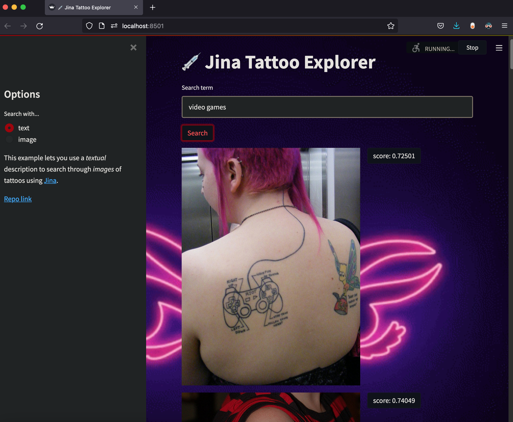

# jina-clip-streamlit

Wait forrrr ittt....
<p align="center">
  <a href=docs/usage/workstitle.jpg>
    
  </a>
</p>

<div>
    <p align="center">
        Jina app which allows you to search a collection of tattoo images by text or image.
    </p>
    <br>
    <p align="center">
        This project was inspired by: 
        https://github.com/jina-ai/example-multimodal-fashion-search
    </p>
</div>

----
## Examples
Searching by text.
Query text: video games


Searching by image.


## Instructions
## Here is how you run this:

How to run yourself.

### Setup

```git clone https://github.com/k-zehnder/jina-clip-streamlit```

```cd jina-clip-streamlit```

```pip install -r requirements.txt```

### Download data
```https://www.fer.unizg.hr/_download/repository/tattoo_images.zip```

When you go to the link above it should begin downloading the tattoo image dataset. Its about 1500 images. Create a folder in the root directory called "data", and then inside the data folder make another folder called "tattoo_images". Dump the images you downloaded into the "tattoo_images" folder that you made inside the "data" folder. Use the directory structure below to help keep you oriented.

```
.
├── data
│   └── tattoo_images
├── docs
│   └── usage
├── frontend
│   ├── __pycache__
│   ├── config.py
│   ├── frontend.py
│   ├── helpers.py
│   └── widgets.py
├── image_searcher
│   ├── app.py
│   └── config.py
├── indexer
│   ├── __pycache__
│   ├── app.py
│   └── helpers.py
├── text_searcher
│   ├── app.py
│   └── config.py
├── workspace # 'workspace' directory will be created automatically when you index so don't worry about this to start. It will be created when you index.
│   └── PQLiteIndexer
├── README.md
├── dataset_instructions.txt
├── post.txt
├── requirements.txt
└── website.txt
```

### Create embeddings and index your data

This will create embeddings for all images using CLIPImageEncoder, and then store them on disk (with metadata) with PQLiteIndexer.

Open a new terminal window/tab, and run from same root directory.
1. `python indexer/app.py to index data` 

### Run search backend

Open a new terminal window/tab, run from same root directory.
1. `python indexer/app.py` to start the search server(s)

### Run frontend

Open a new terminal window/tab, return to same directory
1. `streamlit run frontend/frontend.py`

## Yahtzee! Jina FTW